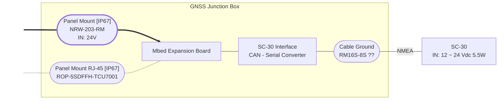
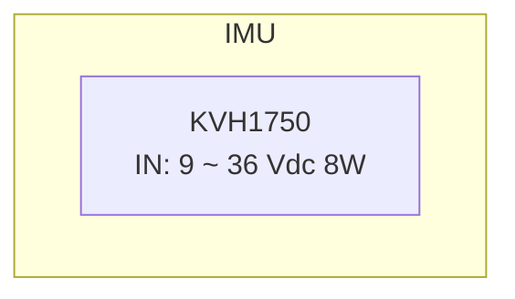
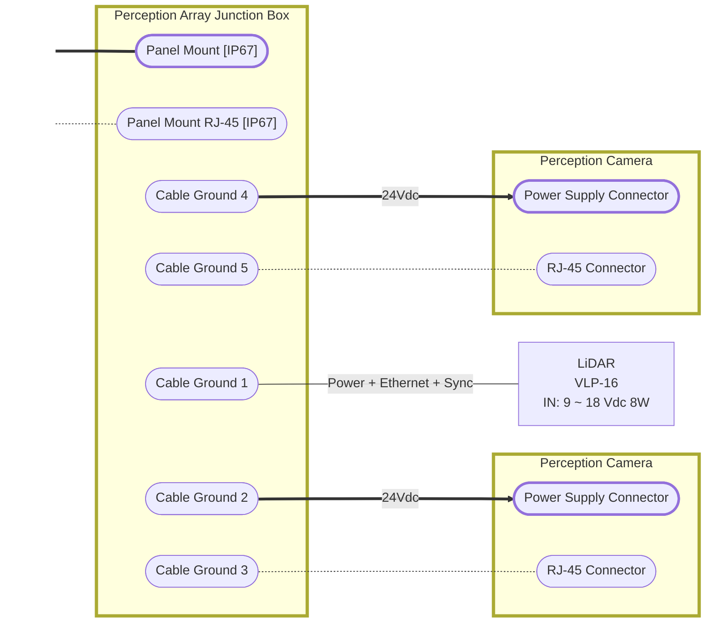
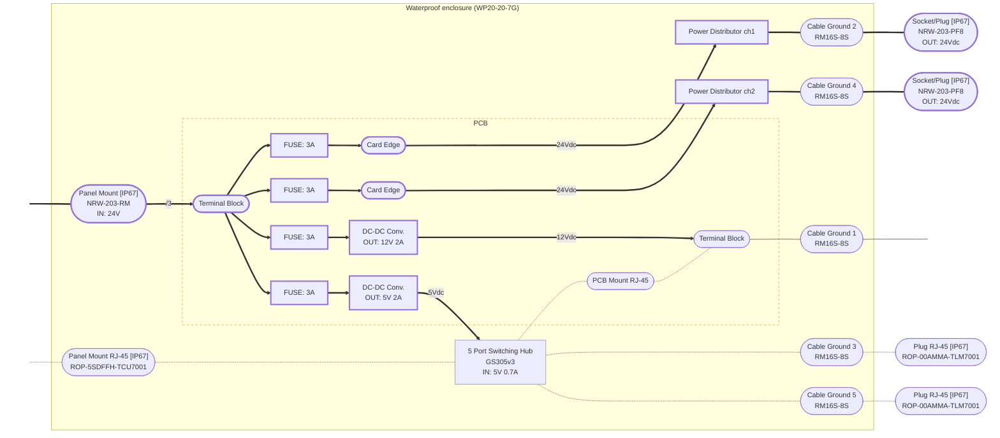
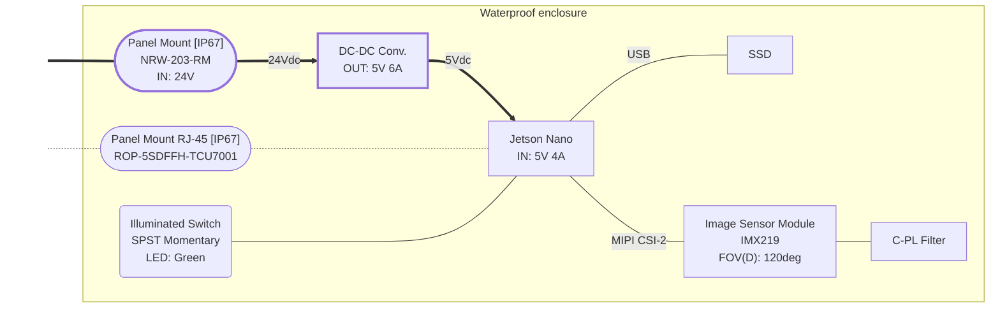
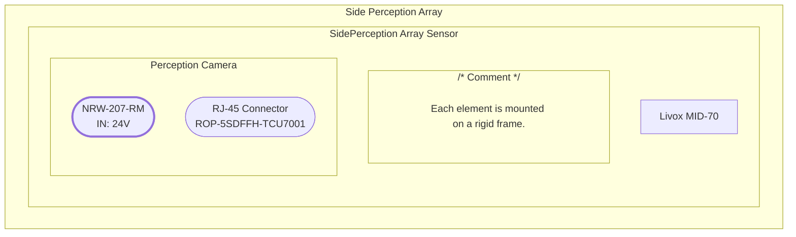
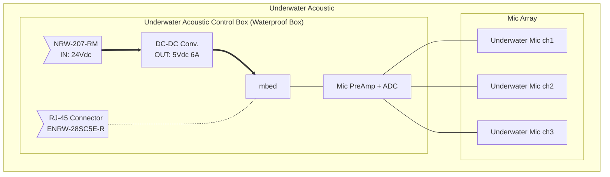
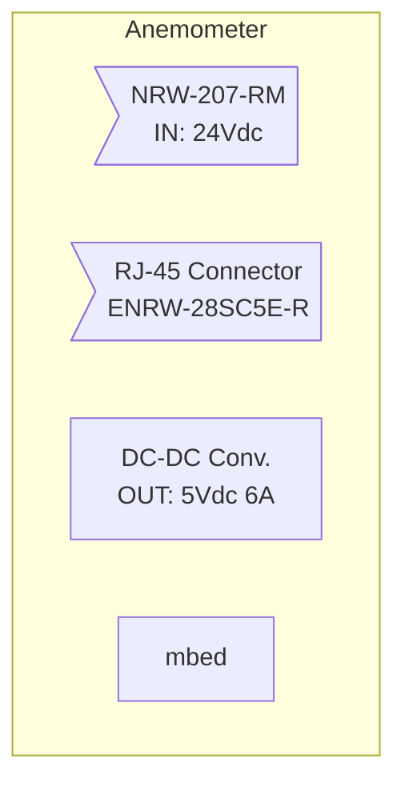

## GNSS

### When using SC-30

### When using F9P

## IMU

## Optical Sensing

### Perception Array

Waterproof enclosure (WP20-20-7G) Cable glands for cable penetrations
Each element is mounted on a rigid frame.

#### Perception Array Junction Box

[Circuit Design Documentation](../../circuit_design/perception-array-interface-board.md)

#### Perception Camera

### Side Perception Array

## Underwater Acoustic

## Anemometer

