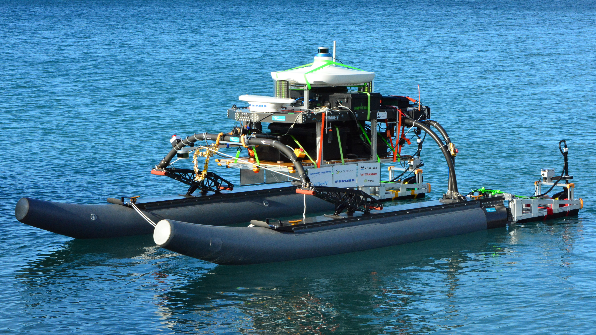

---
hide:
  - navigation
---

# About this documentation

<figure style="display:table;background-color:#ffffff;float:right;padding:0px 0px 0px 20px">
  
  <figcaption style="display:table-caption;caption-side:bottom;text-align:center;font-weight:bold;color:navy">Our robotic catamaran in 2018 @Hawaii</figcaption>
</figure>

This documentation site represents the architecture and detailed design of the hardware that OUXT is developing for RobotX. It includes not only information that has already been developed, but also is in the conceptual stage.

This documentation is divided into the following four parts.

- [Architecture](architecture/architecture_summary.md)
- [Mechanical Design](mech_design/mdesign_summary.md)
- [Circuit Design](circuit_design/cdesign_summary.md)
- [Reference](reference/reference_summary.md)

If you want to know the overall structure of the robot, please refer to the "Architecture" part. The details of each component are described in the "Mechanical Design" part or "Circuit Design" part. The "Reference" part contains information about off-the-shelf products used in the robot and related laws and regulations that should be complied with when conducting experiments.

## OUXT Polaris

We have been participating in the RobotX Challenge since 2014, and we are currently the only team in Japan.

The official team website is [here](https://www.ouxt.jp/en/){:target="_blank"}.

## RobotX Challenge

[The RobotX Challenge](https://robotx.org/){:target="_blank"} is an international, university-level competition that aims to develop autonomous navigation technology for small boats. Each team is required to develop and install a propulsion system, sensors, computers, communication devices, and other systems necessary for autonomous navigation on a catamaran called [WAM-V](https://www.wam-v.com/){:target="_blank"}, which is provided by the competition organizers.

<figure>
  
  <figcaption style="caption-side:bottom;text-align:center;font-weight:bold;color:navy">Rendering image of an example RobotX course layout.</figcaption>
</figure>
