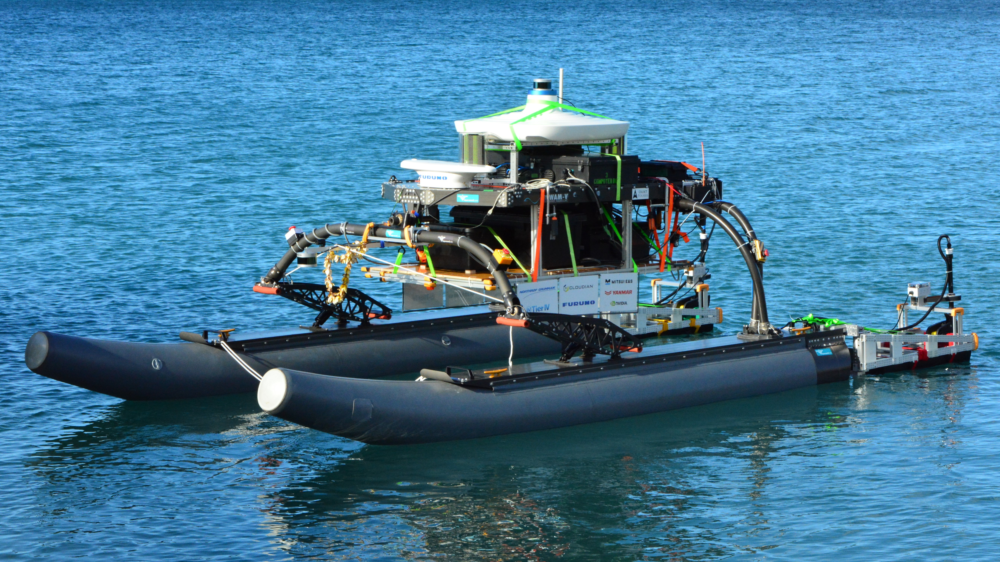
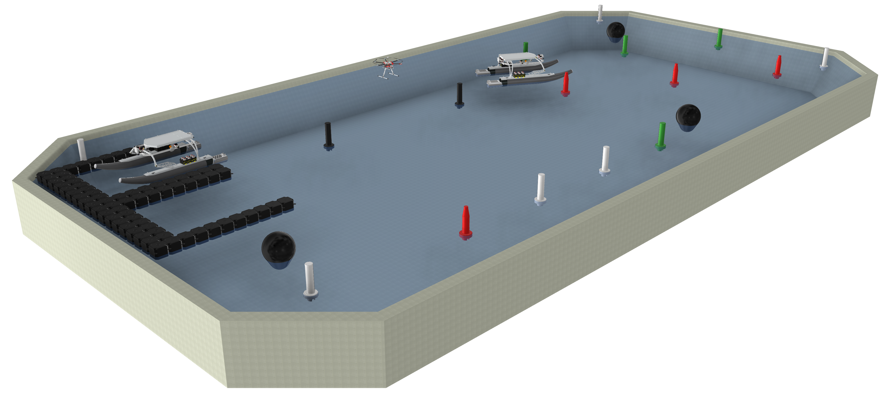
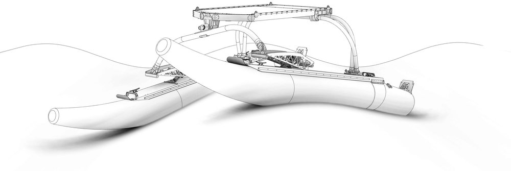

---
hide:
  - navigation
---

# About this documentation

<figure style="display:table;background-color:#ffffff;float:right;padding:0px 0px 0px 20px">
  
  <figcaption style="display:table-caption;caption-side:bottom;text-align:center;font-weight:bold;color:navy">Our robotic catamaran in 2018 @Hawaii</figcaption>
</figure>

This documentation site represents the architecture and detailed design of the hardware that OUXT is developing for RobotX. It includes not only information that has already been developed, but also is in the conceptual stage.

## OUXT Polaris

We have been participating in the RobotX Challenge since 2014, and we are currently the only team in Japan.

The official team website is [here](https://www.ouxt.jp/en/).

## RobotX Challenge

[The RobotX Challenge](https://robotx.org/) is an international, university-level competition that aims to develop autonomous navigation technology for small boats. Each team is required to develop and install a propulsion system, sensors, computers, communication devices, and other systems necessary for autonomous navigation on a catamaran called [WAM-V](https://www.wam-v.com/), which is provided by the competition organizers.

<figure>
  
  <figcaption style="caption-side:bottom;text-align:center;font-weight:bold;color:navy">Rendering image of an example RobotX course layout.</figcaption>
</figure>

### WAM-V

<figure style="display:table;float:right;margin:0px 0px 0px 20px">
  
  <figcaption style="display:table-caption;caption-side:bottom;text-align:center;font-weight:bold;color:navy">Wave Adaptive Suspension [ Marine Advanced Robotics, Inc. https://www.wam-v.com/about ]</figcaption>
</figure>

As a rule of the competition, the basic structure of the USV must be the WAM-V 16 ASV manufactured by Marine Advanced Robotics. The WAM-V is a catamaran that has a feature called Wave Adaptive Suspension, which enables the left and right hulls to oscillate independently in response to the water surface. The WAM-V provided by the competition organizer does not include any outfitting other than the hull, such as propulsion units, batteries, and sensors. The specifications are shown in the table below.

| Item | Value |
| --- | --- |
| Length | 3910 mm |
| Beam | 2440 mm |
| Payload | 136 kg |
| Full Load Displacement | 255 kg |
| Draft | 165 mm |

## Page Navigation

### Home

This page.

### [Architecture](architecture/architecture_summary.md)

The architecture of the robot for each competition is described. The main components and their connections are shown in figures. For detailed design of each element, refer to the Mechanical Design and Circuit Design pages.

### [Mechanical Design](mech_design/mdesign_summary.md)

It contains the design documents, drawings, and manufacturing data of the mechanical systems that have been developed to date.

### [Circuit Design](circuit_design/cdesign_summary.md)

It contains design documents, circuit diagrams, and manufacturing data for electrical systems that have been developed to date.

### [Reference](reference/reference_summary.md)

It contains information about the laws and regulations that must be followed when participating in competitions and experiments, and about the ready-made products that we use.